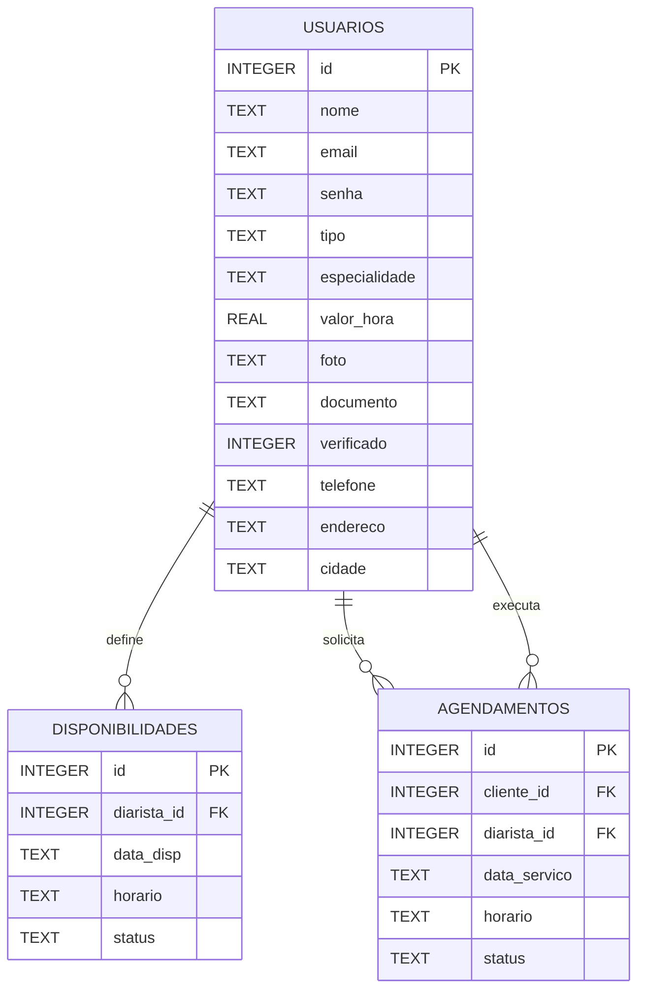

# Estrutura do Banco de Dados

Este projeto usa SQLite e as informações do banco de dados estão conforme o arquivo de configuração:

- `config/database.php` → banco `casalimpa.sqlite`

---

## 1) Banco: `casalimpa.sqlite` (arquivo `config/database.php`)

### Tabela `usuarios`
- `id` INTEGER PK AUTOINCREMENT
- `nome` TEXT NOT NULL
- `email` TEXT UNIQUE NOT NULL
- `senha` TEXT NOT NULL
- `tipo` TEXT NOT NULL
- `especialidade` TEXT
- `valor_hora` REAL
- `foto` TEXT
- `documento` TEXT
- `verificado` INTEGER DEFAULT 0
- `telefone` TEXT
- `endereco` TEXT
- `cidade` TEXT

### Tabela `disponibilidades`
- `id` INTEGER PK AUTOINCREMENT
- `diarista_id` INTEGER (FK → `usuarios.id`)
- `data_disp` TEXT
- `horario` TEXT
- `status` TEXT DEFAULT `'Livre'`

### Tabela `agendamentos`
- `id` INTEGER PK AUTOINCREMENT
- `cliente_id` INTEGER (FK → `usuarios.id`)
- `diarista_id` INTEGER (FK → `usuarios.id`)
- `data_servico` TEXT
- `horario` TEXT
- `status` TEXT DEFAULT `'Pendente'`

## Diagrama (Mermaid)

## Relacionamentos
- `usuarios` (1) → (N) `disponibilidades` via `disponibilidades.diarista_id`
- `usuarios` (1) → (N) `agendamentos` via `agendamentos.cliente_id`
- `usuarios` (1) → (N) `agendamentos` via `agendamentos.diarista_id`

## Observações
- `tipo` em `usuarios` define o papel (ex.: cliente/diarista) e direciona quais relações se aplicam.
- O status de `disponibilidades` e `agendamentos` controla o fluxo de agendamento.

